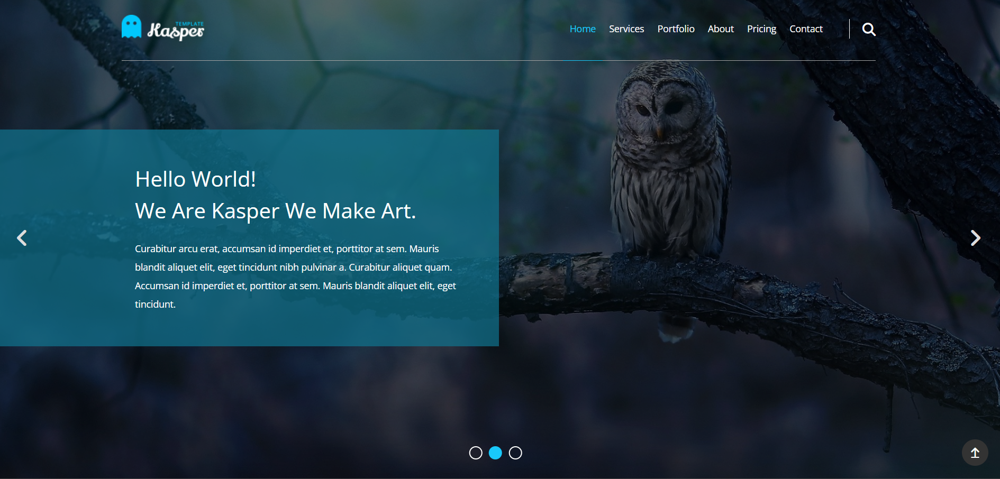

# Kasper - HTML & CSS Template 🖌️🌐

<div align="center">

A feature-rich creative agency landing page template built with pure HTML and CSS. Features an animated hero slider, portfolio shuffle grid, video background section, stats counter, skills bars, pricing plans, and more — all fully responsive.

<br>

<div align="center">
  <a href="https://tendopain18.github.io/html-css-template-kasper/" target="_blank">
    
  </a>
</div>

<br>
<br>

[](https://tendopain18.github.io/html-css-template-kasper/)

</div>

## 🎨 About The Project

Kasper is a comprehensive creative agency template with a rich set of sections covering everything a professional agency site needs. It features an overlay hero with navigation bullets, filterable portfolio, embedded video background, animated stats, testimonials, skill progress bars, a pricing table, newsletter form, and a full contact section — all built with pure HTML and CSS.

## ✨ Features

- **Sticky Transparent Header**: Fixed navigation with mobile hamburger toggle
- **Hero Slider**: Full-screen background with left/right navigation arrows and bottom bullets
- **Services Grid**: Icon + text service boxes in a responsive two-column layout
- **Design Features Section**: Parallax-style background with a floating mobile image
- **Portfolio Grid**: Image gallery with hover caption overlay effect
- **Video Background Section**: Looping background video with centered overlay text
- **Stats Section**: Four-column stats counter with icon badges and background image overlay
- **Testimonials & Skills**: Side-by-side testimonial carousel and animated CSS progress bars
- **Quote Section**: Full-width styled blockquote with background image
- **Pricing Plans**: Four-column pricing cards with tiered plan details
- **Subscribe Form**: Email subscription bar with background image
- **Contact Form**: Full contact form alongside address and phone info
- **Scroll-to-Top Button**: Fixed animated floating button

## 🚀 Getting Started

1. **Clone the repository**
```bash
git clone https://github.com/TendoPain18/html-css-template-kasper.git
```

2. **Open in browser**
```
Open index.html directly in any modern browser
```

No build tools or dependencies required.

## 🛠️ Built With

- **HTML5** — Semantic markup
- **CSS3** — Custom properties, Flexbox, CSS Grid, keyframe animations, media queries
- **Font Awesome 6** — Icons
- **Google Fonts** — Open Sans typeface

## 📄 License

This project is licensed under the MIT License.

## 🙏 Acknowledgments

- Design inspired by [Elzero Web School](https://elzero.org)
- Icons by Font Awesome

<br>
<div align="center">
  <a href="https://tendopain18.github.io/html-css-template-kasper/" target="_blank">
    
  </a>
</div>
<br>

## <!-- CONTACT -->
<!-- END CONTACT -->
